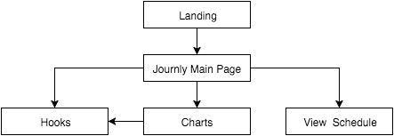

#Journ.ly
---
##Introduction
Journ.ly attempts to be your personal journal-slash-activity and habit tracker (Lets say it's a bit of everything). It uses #hashtags to classify tasks, define privacy, and add activity hooks.

##Scenarios
####Scenario 1: Me
I would like to keep track of my thoughts throughout the day and log my activities in one place for a quick lookup and some in-depth analysis of my habits over a period of time. I like charts and graphs, sue me.

####Scenario 2: Jake
Jake likes keeping track of everything to keep everything organized, however, he uses a calendar and Excel sheets to do so. Instead, he could use Journly to keep track of literally everything along with notes to his future self about that happen in his life.

##Non Goals

* Plugins
* Webhooks

##Flowchart

##Screen by Screen Specification
All screens are created in JSX and SASS.
###Landing
The landing page is a very simple page that prompts you to sign in to see your Journal, a very reasonable proposition. If you are signed in, it skips the landing page and goes to the ``Main Page``.

###Main Page

The main page lets you search for posts and create new posts with tags to describe your thoughts and log your activities.

It has links to the ``Schedule``, ``Hooks``, and ``Charts``.

###Hooks
The Hooks Page of the Application lets you manage datasets and set up hooks for events to do a specific thing.

Kinda like Zapier. (See for inspiration on implementation)

###Schedule
 
Nothing too fancy, just a calendar with organized things. Syncs with Google Calendar. 
